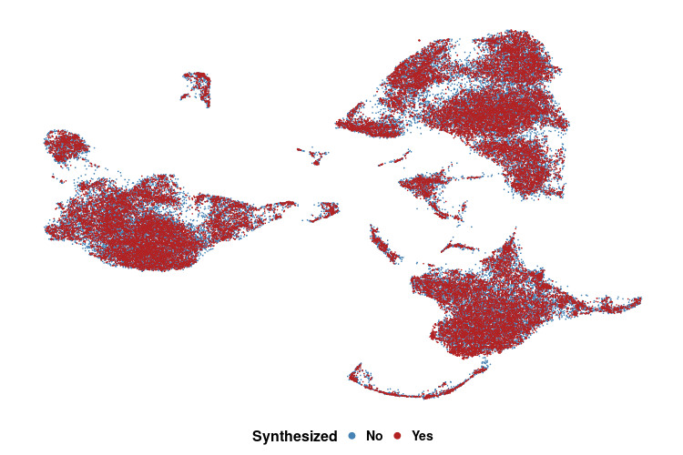
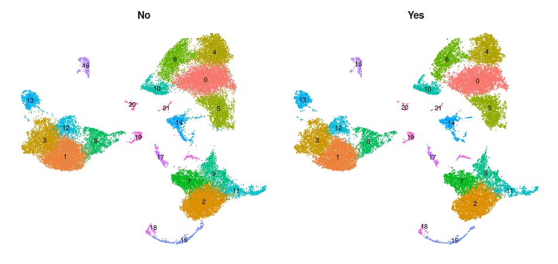

[](http://www.repostatus.org/#active)
[](https://www.tidyverse.org/lifecycle/#stable)

<p align="center" width="100%">
 
</p>

# scGFT 

scGFT (single-cell Generative Fourier Transformer) is a generative model built
upon the principles of the Fourier Transform. It employs a one-shot
transformation paradigm to synthesize single-cell gene expression profiles that
reflect the natural biological variability found in authentic datasets.

---


## Installation

<details>
<br>

**scGFT** can be installed directly from this github with:

```{r}
if (!require("devtools", quietly = TRUE))
  install.packages("devtools")

devtools::install_github("Sanofi-Public/PMCB-scGFT", 
                         build_vignettes=FALSE)
```

</details>

---


## Usage Requirements

<details>
<br>

scGFT framework is designed to be compatible with the Seurat R analysis pipelines. 
To install, please run:

```{r}
# Enter commands in R (or R studio, if installed)
install.packages("Seurat")
install.packages("SeuratObject")
```

Visit [Seurat](https://satijalab.org/seurat/articles/install_v5) for more details.

</details>

---


## Functions Introduction

<details>
<br>

The scGFT package comprises only two functions: one to synthesize cells and a
second to evaluate the synthesis quality.

```r
# to synthsize cells
RunScGFT(object, nsynth, ncpmnts = 1, groups = NULL, cells = NULL)
```

`RunScGFT` requires, at a minimum, a Seurat object (`object`), the number of
desired cells to be synthesized (`nsynth`), and a metadata variable indicating
groups of cells (`groups`), or `cells` for cell-specific synthesis. `cells` 
specifies the list of barcode(s) of the cell(s) to be used for cell-based synthesis. 
For elemnts of the list with one cell barcode, `nsynth` cells will be synthesized. 
If a `vector` of barcodes is provided, `nsynth` cells will be synthesized for the 
specified group of barcodes.

```r
# to evaluate synthsized cells
statsScGFT(object, groups)
```

`statsScGFT` requires a Seurat object that includes synthesized cells (`object`)
and a character variable from the original object metadata (`groups`). 
It calculates the likelihood that synthesized cells will have the same identity 
as their original counterparts. It also reports the relative deviation of 
synthesized gene expression profiles from original cells.

</details>

---


## Use Case 

<details>
<br>

#### Get demo files

We provided the dataset PRJEB44878 (Wohnhaas 2021), which comprises 34,200
processed cells derived from primary small airway epithelial cells from 
healthy individuals and patients with chronic obstructive pulmonary
disease. To download this dataset please run:

```{r}
# Enter commands in R (or R studio, if installed)
data_url <- "https://zenodo.org/records/12516896/files/scGFT_GitHub_PRJEB44878.rds"
data_path <- "~/scGFT_GitHub_PRJEB44878.rds" # correct destination path includes the filename
download.file(url=data_url, destfile=data_path, method="auto")
```


#### Read data into R
```{r}
data_obj <- readRDS(data_path)
cnts <- data_obj$counts
mtd <- data_obj$metadata
```


#### Perform Seurat standard pipeline including synthesis process
```{r}
set.seed(1234)
sobj_synt <- CreateSeuratObject(counts=cnts,
                                meta.data=mtd) %>%
  NormalizeData(., normalization.method="LogNormalize", scale.factor=1e4) %>%
  FindVariableFeatures(., nfeatures=2000) %>%
  ScaleData(.) %>%
  RunPCA(., seed.use=42) %>%
  RunHarmony(., group.by.vars="sample") %>% # sample-specific batch correction
  FindNeighbors(., reduction="harmony", dims=1:30) %>%
  FindClusters(., random.seed=42) %>%
  # ================================
  # synthesis 34,200 cells (1x), through modification of 10 complex components.
  RunScGFT(., nsynth=1*dim(.)[2], ncpmnts=10, groups="seurat_clusters") %>%
  # The combined dataset of original and synthetic cells undergoes another round. 
  # Re-normalization is not needed as the new cells are synthesized from already normalized data.
  # ================================
  FindVariableFeatures(., nfeatures=2000) %>%
  ScaleData(.) %>%
  RunPCA(., seed.use=42) %>%
  RunHarmony(., group.by.vars="sample") %>% # sample-specific batch correction
  FindNeighbors(., reduction="harmony", dims=1:30) %>%
  FindClusters(., random.seed=42) %>%
  RunUMAP(., reduction="harmony", seed.use=42, dims=1:30)
```

`RunScGFT` console outputs:

```{r}
Discrete fourier transform...
Inverse fourier transform...
synthesizing 34,200 cells...
4,902 cells synthesized...
9,712 cells synthesized...
14,389 cells synthesized...
17,116 cells synthesized...
19,708 cells synthesized...
21,988 cells synthesized...
24,052 cells synthesized...
25,812 cells synthesized...
27,264 cells synthesized...
28,563 cells synthesized...
29,474 cells synthesized...
30,334 cells synthesized...
31,123 cells synthesized...
31,898 cells synthesized...
32,570 cells synthesized...
33,226 cells synthesized...
33,600 cells synthesized...
33,882 cells synthesized...
34,057 cells synthesized...
34,150 cells synthesized...
34,200 cells synthesized...
Deviation from originals: 0.15 +/- 0.01
Synthesis completed in: 1.91 min
Integrating data (1/2)
  [==================================================] 100% in 36s
Integrating data (2/2)
  [==================================================] 100% in  2m
A Seurat object with 68,400 cells, including 34,200 synthesized.
```


#### Evaluate synthsized cells

```{r}
statsScGFT(object=sobj_synt, groups="seurat_clusters")
```

`statsScGFT` console outputs:

```{r}
Synthesized cells: 34,200
Matching cells: 32,157
Accuracy (%): 94.03
```

Utilizing UMAP for a qualitative evaluation, we project synthesized and
real cells onto the embedded manifold:

<p align="center" width="100%">

</p>

<p align="center" width="100%">

</p>

Depending on the operating system used for calculations and due to the
stochastic nature of a generative model, the results can differ from the
projected ones.


#### Perform cell-based synthesis:

In this showcase, we expand rare epithelial subtypes, including aberrant
basaloid cells, PNECs, and ionocytes, each comprising less than 0.3% of the
population. An individual cell from each cell type was randomly selected for 
synthesis:

```{r}
set.seed(1234)
sobj_exp <- CreateSeuratObject(counts=cnts,
                                meta.data=mtd) %>%
  NormalizeData(., normalization.method="LogNormalize", scale.factor=1e4) %>%
  FindVariableFeatures(., nfeatures=2000) %>%
  ScaleData(.) %>%
  RunPCA(., seed.use=42) %>%
  RunHarmony(., group.by.vars="sample") %>% # sample-specific batch correction
  FindNeighbors(., reduction="harmony", dims=1:30) %>%
  # ================================
  # synthesis 1,000 cells, through modification of 10 complex components, for each of given annotated rare epithelial subtypes
  RunScGFT(., nsynth=1000, ncpmnts=10, cells = list("S2_ACGGAGAGTTCCCGAG-1", # a pre-annotated "Ionocyte" cell
                                                    "S1_ATTACTCTCGTTGCCT-1", # a pre-annotated "PNEC" cell
                                                    "S1_AAGCCGCGTGCCTGCA-1") # a pre-annotated "Aberrant basaloid" cell
                                                    ) %>% 
  # ================================
  FindVariableFeatures(., nfeatures=2000) %>%
  ScaleData(.) %>%
  RunPCA(., seed.use=42) %>%
  RunHarmony(., group.by.vars=c("sample")) %>% # sample-specific batch correction
  FindNeighbors(., reduction="harmony", dims=1:30) %>%
  FindClusters(., random.seed=42) %>%
  RunUMAP(., reduction="harmony", seed.use=42, dims=1:30)
```

`RunScGFT` console outputs:

```{r}
Discrete fourier transform...
Inverse fourier transform...
synthesizing 1,000 cells...
1,000 cells synthesized...
Deviation from originals: 0.27 +/- 0.05
Discrete fourier transform...
Inverse fourier transform...
synthesizing 1,000 cells...
1,000 cells synthesized...
Deviation from originals: 0.12 +/- 0.09
Discrete fourier transform...
Inverse fourier transform...
synthesizing 1,000 cells...
1,000 cells synthesized...
Deviation from originals: 0.19 +/- 0.08
Synthesis completed in: 0.02 min
Integrating data (1/2)
  [==================================================] 100% in  1s
Integrating data (2/2)
  [==================================================] 100% in  3s
A Seurat object with 37,200 cells, including 3,000 synthesized.
```


#### Evaluate synthsized cells

Next, we evaluate the consistency of cell types in synthesized cells relative to
the originals. Cells goes through another round of cell type annotation using
[Sargent](https://github.com/Sanofi-Public/PMCB-Sargent), an automated, 
cluster-free, score-based annotation method that classifies cell types based on
distinct [markers](inst/doc/genesets.xlsx) 
(a helper script can be found [here](inst/doc/sargent_helper.R)). 
Then, the annotations of the synthesized cells are evaluated by:

```{r}
statsScGFT(object=sobj_synt, groups="sargent_celltype")
```

`statsScGFT` console outputs:

```{r}
Synthesized cells: 3,000
Matching cells: 2,998
Accuracy (%): 99.93
```

Utilizing UMAP for a qualitative evaluation, we project synthesized and
real cells onto the embedded manifold:

<p align="center" width="100%">

</p>

Depending on the operating system used for calculations and due to the
stochastic nature of a generative model, the results can differ from the
projected ones.


</details>

---


## Custom Functions

<details>
<br>

To facilitate the application of `scGFT` on large datasets, `RunScGFT_Helper` 
enables users to split data into smaller, manageable groups for processing:

```r
RunScGFT_Helper <- function(object, scale_factor, ncpmnts=1, groups=NULL){
  grps <- as.character(unique(object@meta.data[[groups]]))
  sobj_ls <- lapply(grps, function(x) {
    sobj_sub <- subset(object, cells = Cells(object)[object@meta.data[[groups]] == x]) %>%
      RunScGFT(., nsynth=scale_factor*dim(.)[2], ncpmnts=ncpmnts, groups=groups) 
  })
  message(paste("merging", length(sobj_ls), "objects..."))
  sobj_mrgd <- merge(sobj_ls[[1]], y=sobj_ls[-c(1)], merge.data=TRUE, merge.dr=FALSE)
  message(paste("joining", length(sobj_ls), "layers..."))
  sobj_mrgd <- SeuratObject::JoinLayers(sobj_mrgd, assay="RNA")
  return(sobj_mrgd)
}
```

</details>

---


## Contact

<details>
<br>

For help and questions please contact the [scgft's maintenance team](mailto:nima.nouri@sanofi.com).

</details>

---
